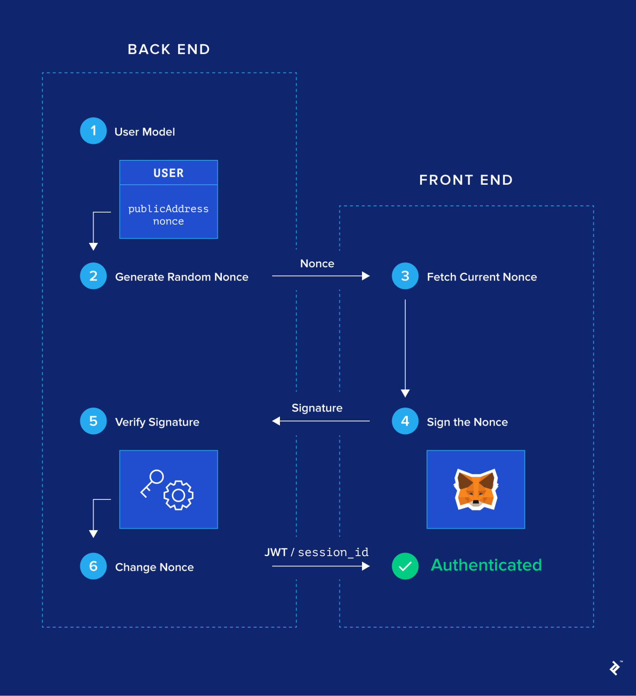

# web3chat
web3聊天室

## 依赖
go get github.com/ethereum/go-ethereum
go get github.com/jinzhu/gorm
go get github.com/garyburd/redigo

## 22.2.18
今天打算做一个web3的聊天室，目前考虑的是这样的：
1. 和discord一样，聊天室有不同的名字，可以新建、删除（必须是owner），每个人只能建10个聊天室
2. 通过metamask登录，这个还不知道怎么做
3. 

### 技术路线：
1. 使用gin+react+websocket

### MySql建表
1. message
```Golang
var content string
var from_id string
var created_at uint64
var modified_at uint64
var room_id uint64

```

2. room
```Golang
var room_id uint64
var room_name string
var created_at uint64
var is_deleted bool
var owner string
var description string

```

3. user
```Golang
var user_id uint64
var user_name string
var alias string // ens...
var created_at uint64
var is_deleted bool
var room_ids []uint64

```

## 22.2.20

metamask登录流程：
1. 后端生成一个随机数nonce
2. 前端链接metamask钱包并签名该nonce
3. 后端收到该nonce的签名
4. 发一个session_id，并且在redis设置该id的有效时间，每次交互的时候验证是否过期吧
todo: 然后怎么搞呢？应该是发一个session（jwt）保持连接？然后定期更换nonce并重新签名？


## 22.2.21
后端的统一response结构为
```Golang
gin.H{
    "data": {
        "status": ...,
        "user_type": ...,
        "extra_msg": ...,
    }
    "...": ...,
}
```